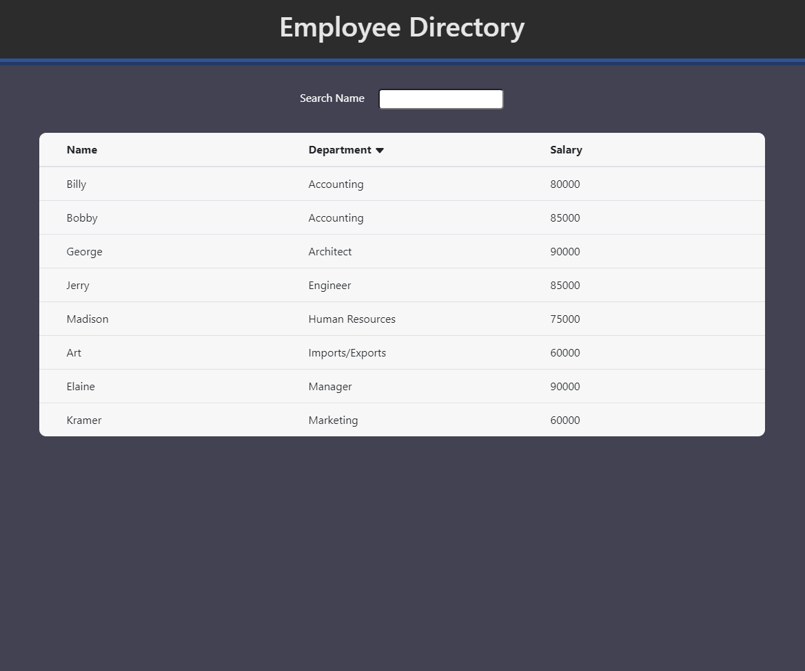

# Employee Directory

React app built with create-react-app that displays a list of employees for someone to Create read and Delete.

Data comes from "employees.json" which is located in src/ folder. You can search the employees by name and sort them by name, department or salary.

https://wbrink.github.io/employee-directory/

